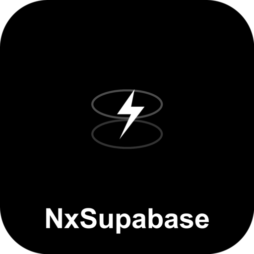

<div align="center">



<h1>NxSupabase</h1>

**The official Nx plugin for Supabase**

Automated migrations, type generation, and local dev setup for Nx monorepos.

[](https://www.npmjs.com/package/@nxsupabase/supabase)
[](https://opensource.org/licenses/MIT)
[](https://www.npmjs.com/package/@nxsupabase/supabase)
[](https://github.com/nxsupabase/nxsupabase)

[Getting Started](#getting-started) · [Features](#features) · [Documentation](#documentation) · [Contributing](#contributing)

</div>

---

## Why NxSupabase?

Building modern applications with **Supabase** in an **Nx monorepo**? This plugin streamlines your entire workflow:

- **Zero Configuration** - Auto-detect Supabase projects via `config.toml`
- **Smart Port Management** - Run multiple Supabase instances without conflicts
- **Nx Caching** - Generated types are cached and only regenerated when needed
- **Full Lifecycle Support** - From local dev to production deployment

---

## Features

| Feature | Description |
|---------|-------------|
| **Generators** | Scaffold Supabase projects, migrations, Edge Functions, and seed files |
| **Executors** | Start/stop local instances, run migrations, generate types, deploy |
| **Type Safety** | Auto-generate TypeScript types from your database schema |
| **Multi-Project** | Support multiple Supabase instances with automatic port allocation |
| **Project Inference** | Auto-detect and configure targets via `createNodesV2` |
| **Docker Orchestration** | Full local Supabase stack management |

---

## Getting Started

### Prerequisites

Before you begin, ensure you have:

- [Node.js](https://nodejs.org/) 18+ installed
- [Docker Desktop](https://www.docker.com/products/docker-desktop/) installed and running
- [Supabase CLI](https://supabase.com/docs/guides/cli) installed:

```bash
# Via npm
npm install -g supabase

# Or via Homebrew (macOS)
brew install supabase/tap/supabase
```

### Installation

```bash
npm install @nxsupabase/supabase --save-dev
```

### Quick Start

#### 1. Initialize the plugin

```bash
nx g @nxsupabase/supabase:init
```

This registers the plugin in your `nx.json` and configures target defaults.

#### 2. Add Supabase to a project

```bash
nx g @nxsupabase/supabase:project --project=my-app
```

This creates the Supabase directory structure:

```
apps/my-app/
└── supabase/
    ├── config.toml          # Supabase configuration
    ├── migrations/          # Database migrations
    ├── functions/           # Edge Functions
    └── seed.sql             # Seed data
```

#### 3. Start local development

```bash
nx run my-app:supabase-start
```

This spins up the full Supabase stack locally (PostgreSQL, Auth, Storage, Realtime, etc.)

#### 4. Create your first migration

```bash
nx g @nxsupabase/supabase:migration --project=my-app --name=create_users_table
```

#### 5. Generate TypeScript types

```bash
nx run my-app:supabase-gen-types
```

Types are automatically cached by Nx and regenerated only when migrations change.

---

## Documentation

### Generators

| Generator | Description | Command |
|-----------|-------------|---------|
| `init` | Initialize plugin in workspace | `nx g @nxsupabase/supabase:init` |
| `project` | Add Supabase to a project | `nx g @nxsupabase/supabase:project --project=<name>` |
| `migration` | Create a database migration | `nx g @nxsupabase/supabase:migration --project=<name> --name=<migration>` |
| `function` | Create an Edge Function | `nx g @nxsupabase/supabase:function --project=<name> --name=<function>` |
| `seed` | Create a seed file | `nx g @nxsupabase/supabase:seed --project=<name>` |

### Executors

| Executor | Description | Command |
|----------|-------------|---------|
| `supabase-start` | Start local Supabase | `nx run <project>:supabase-start` |
| `supabase-stop` | Stop local Supabase | `nx run <project>:supabase-stop` |
| `supabase-status` | Show status and URLs | `nx run <project>:supabase-status` |
| `supabase-db-reset` | Reset database | `nx run <project>:supabase-db-reset` |
| `supabase-gen-types` | Generate TS types | `nx run <project>:supabase-gen-types` |
| `supabase-migrate` | Run migrations | `nx run <project>:supabase-migrate` |
| `supabase-db-push` | Push to remote | `nx run <project>:supabase-db-push` |
| `supabase-deploy` | Deploy to cloud | `nx run <project>:supabase-deploy` |
| `supabase-functions-serve` | Serve functions locally | `nx run <project>:supabase-functions-serve` |

### Multi-Project Support

Run multiple Supabase instances in your monorepo:

```bash
# Start all Supabase instances
nx run-many -t supabase-start

# Generate types for all projects
nx run-many -t supabase-gen-types

# Only affected projects
nx affected -t supabase-db-reset
```

### Configuration

Configure the plugin in `nx.json`:

```json
{
  "plugins": [
    {
      "plugin": "@nxsupabase/supabase",
      "options": {
        "startTargetName": "supabase-start",
        "stopTargetName": "supabase-stop",
        "genTypesTargetName": "supabase-gen-types"
      }
    }
  ]
}
```

### Environment Variables

The plugin loads environment variables from (in order):

1. Workspace root `.env`
2. Workspace root `.env.local`
3. Project `.env`
4. Project `.env.local`

Common variables:

| Variable | Description |
|----------|-------------|
| `SUPABASE_ACCESS_TOKEN` | Authentication for deployment |
| `SUPABASE_DB_PASSWORD` | Remote database password |
| `SUPABASE_PROJECT_REF` | Remote project reference |

---

## Usage Examples

### Using Generated Types

```typescript
import { createClient } from '@supabase/supabase-js';
import type { Database } from './types/supabase';

const supabase = createClient<Database>(
  process.env.SUPABASE_URL!,
  process.env.SUPABASE_ANON_KEY!
);

// Fully typed queries
const { data: users } = await supabase
  .from('users')
  .select('id, email, created_at')
  .eq('active', true);

// TypeScript knows the shape of `users`
```

### Creating an Edge Function

```bash
nx g @nxsupabase/supabase:function --project=my-app --name=send-email --template=basic
```

```typescript
// supabase/functions/send-email/index.ts
import { serve } from 'https://deno.land/std@0.168.0/http/server.ts';

serve(async (req) => {
  const { to, subject, body } = await req.json();

  // Your email logic here

  return new Response(JSON.stringify({ success: true }), {
    headers: { 'Content-Type': 'application/json' },
  });
});
```

### Deploying to Production

```bash
# Link to your Supabase project
npx supabase link --project-ref your-project-ref

# Deploy everything
nx run my-app:supabase-deploy
```

---

## Contributing

Contributions are welcome! Please read our contributing guidelines before submitting a PR.

1. Fork the repository
2. Create your feature branch (`git checkout -b feature/amazing-feature`)
3. Commit your changes (`git commit -m 'Add amazing feature'`)
4. Push to the branch (`git push origin feature/amazing-feature`)
5. Open a Pull Request

---

## License

This project is licensed under the MIT License - see the [LICENSE](LICENSE) file for details.

---

<div align="center">

**Built with love for the Nx and Supabase communities**

[Report Bug](https://github.com/nxsupabase/nxsupabase/issues) | [Request Feature](https://github.com/nxsupabase/nxsupabase/issues)

</div>
